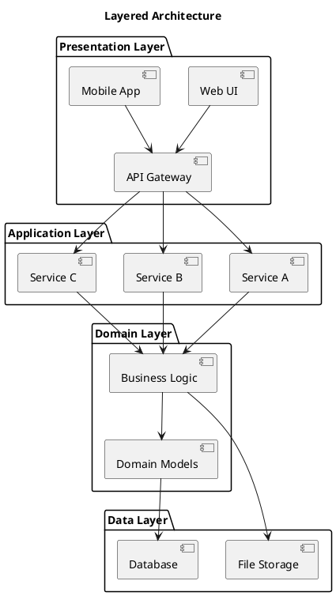

# Technical Documentation Standards - Implementation Plan

> **For Claude:** REQUIRED SUB-SKILL: Use superpowers:executing-plans to implement this plan task-by-task.

**Goal:** Build a comprehensive documentation standards project with templates, examples, and writing guides for internal technical teams.

**Architecture:** Documentation-first structure with separated learning materials (`writing-guide/`), self-contained examples (`examples/`), and reusable resources (`resources/`). All documentation in Markdown with diagram sources in draw.io/PlantUML formats.

**Tech Stack:** Markdown, draw.io, PlantUML, Git

---

## Task 1: Create Root README.md

**Files:**
- Create: `README.md`

**Step 1: Create the root README.md**

Write the main project README with navigation structure:

```markdown
# Technical Documentation Standards and Templates

Comprehensive guidelines, templates, and examples for creating high-quality technical documentation.

## Purpose

This project provides internal development teams with:
- Clear writing guidelines and best practices
- Ready-to-use templates for common document types
- Complete examples demonstrating documentation standards
- Diagram creation guidelines using standard tools

## Quick Start

Get started in 5 minutes → [Quick Start Guide](quick-start.md)

## Project Structure

```
technical-writing/
├── README.md                   # This file
├── quick-start.md              # 5-minute quick start
├── writing-guide/              # Complete writing guide
├── examples/                   # Example projects
│   ├── simple-project/         # Simple project example
│   └── complex-project/        # Complex project example
└── resources/                  # Templates and diagram sources
    ├── templates/              # Copy-ready templates
    └── diagram-sources/        # Reusable diagram templates
```

## Writing Guide

Complete documentation writing guidelines: [Writing Guide](writing-guide/)

1. [Documentation Principles](writing-guide/01-principles.md)
2. [README Documentation](writing-guide/02-readme.md)
3. [Architecture Documentation](writing-guide/03-architecture.md)
4. [Development Guides](writing-guide/04-development.md)
5. [API Documentation](writing-guide/05-api-docs.md)
6. [Creating Diagrams](writing-guide/06-diagrams.md)
7. [Style Guide](writing-guide/07-style-guide.md)

## Examples

### Simple Project Example
A minimal but complete documentation example for small libraries, utilities, and single-purpose projects.

[View Example →](examples/simple-project/)

### Complex Project Example
Complete documentation for multi-module, microservices, and distributed system projects.

[View Example →](examples/complex-project/)

## Templates

Copy-ready templates for common document types: [Templates](resources/templates/)

- [Simple README Template](resources/templates/readme-simple.md)
- [Complex README Template](resources/templates/readme-complex.md)
- [API Documentation Template](resources/templates/api-documentation.md)
- [Architecture Document Template](resources/templates/architecture-doc.md)
- [Development Guide Template](resources/templates/development-guide.md)
- [Deployment Guide Template](resources/templates/deployment-guide.md)

## Diagram Sources

Reusable diagram templates for common architectures: [Diagram Sources](resources/diagram-sources/)

## Contributing

To improve these documentation standards:
1. Review existing examples and templates
2. Propose changes via team discussion
3. Update templates and examples together
4. Maintain consistency across all documents

---

**Team:** Internal Documentation Initiative
**Last Updated:** 2026-03-23
```

**Step 2: Commit the root README**

```bash
git add README.md
git commit -m "docs: add root README with project navigation"
```

---

## Task 2: Create Quick Start Guide

**Files:**
- Create: `quick-start.md`

**Step 1: Create quick-start.md**

```markdown
# Quick Start Guide

Get your project documented in 5 minutes.

## Essential README Elements

Every README must have these 5 critical sections:

1. **Title & Description** - What is this project?
2. **Quick Start** - How to get it running immediately
3. **Usage** - How to use it
4. **Configuration** - What can be configured
5. **API/Documentation Links** - Where to learn more

## Choose Your Template

```
Is your project multi-module or distributed?
├── No → Use Simple Project Template
│   └── Single codebase, < 5 main files
└── Yes → Use Complex Project Template
    └── Multiple services, modules, or components
```

## Copy & Get Started

### Simple Project

```bash
# Copy the template
cp resources/templates/readme-simple.md your-project/README.md

# Edit the placeholders
# Replace [BRACKETED_TEXT] with your project details
```

### Complex Project

```bash
# Copy the template
cp resources/templates/readme-complex.md your-project/README.md

# Create docs directory structure
mkdir -p your-project/docs/{api,images}

# Copy additional templates as needed
cp resources/templates/*.md your-project/docs/
```

## Diagram Tools Quick Reference

| Tool | Best For | File Format |
|------|----------|-------------|
| **draw.io** | Architecture, deployment, component diagrams | `.drawio` → `.png` |
| **PlantUML** | Data flow, sequence, structural diagrams | `.puml` → `.png` |

**Workflow:**
1. Create diagram in draw.io or PlantUML
2. Export as PNG (max width: 800px)
3. Commit both source (.drawio/.puml) and PNG to your repo
4. Reference in markdown: ``

## Next Steps

- Read the [Complete Writing Guide](writing-guide/) for detailed guidelines
- Browse [Examples](examples/) to see standards in action
- Explore [Templates](resources/templates/) for more document types

---

**Need help?** Check the [Writing Guide](writing-guide/) or review the [Examples](examples/).
```

**Step 2: Commit quick-start.md**

```bash
git add quick-start.md
git commit -m "docs: add quick start guide"
```

---

## Task 3: Create Writing Guide Structure

**Files:**
- Create: `writing-guide/README.md`
- Create: `writing-guide/01-principles.md`
- Create: `writing-guide/02-readme.md`
- Create: `writing-guide/03-architecture.md`
- Create: `writing-guide/04-development.md`
- Create: `writing-guide/05-api-docs.md`
- Create: `writing-guide/06-diagrams.md`
- Create: `writing-guide/07-style-guide.md`

**Step 1: Create writing-guide/README.md**

```markdown
# Technical Documentation Writing Guide

Complete guidelines for writing high-quality technical documentation.

## Overview

This guide covers everything you need to know about creating clear, consistent, and useful technical documentation for your projects.

## Contents

1. **[Documentation Principles](01-principles.md)** - Why documentation matters and how to think like a reader
2. **[README Documentation](02-readme.md)** - Writing effective project READMEs
3. **[Architecture Documentation](03-architecture.md)** - Documenting system architecture and design
4. **[Development Guides](04-development.md)** - Creating setup and development workflow guides
5. **[API Documentation](05-api-docs.md)** - Writing clear API documentation
6. **[Creating Diagrams](06-diagrams.md)** - When and how to use diagrams effectively
7. **[Style Guide](07-style-guide.md)** - Writing style and formatting conventions

## How to Use This Guide

- **New to documentation?** Start with [Principles](01-principles.md)
- **Writing a README?** Jump to [README Documentation](02-readme.md)
- **Need to document architecture?** See [Architecture Documentation](03-architecture.md)
- **Creating an API guide?** Read [API Documentation](05-api-docs.md)

## Key Principles

1. **Write for your reader** - Consider their background and goals
2. **Be concise but complete** - Respect your reader's time
3. **Show, don't just tell** - Use examples and diagrams
4. **Keep it current** - Outdated documentation is worse than none
5. **Be consistent** - Follow established patterns and style

## Examples

See [Examples](../examples/) for complete documentation in action:
- [Simple Project Example](../examples/simple-project/)
- [Complex Project Example](../examples/complex-project/)
```

**Step 2: Commit writing-guide README**

```bash
git add writing-guide/README.md
git commit -m "docs: add writing guide overview"
```

---

## Task 4: Create Documentation Principles Guide

**Files:**
- Create: `writing-guide/01-principles.md`

**Step 1: Create the principles guide**

```markdown
# Documentation Principles

The foundation of good technical documentation.

## Why Documentation Matters

Good documentation:
- **Reduces onboarding time** - New developers become productive faster
- **Reduces support burden** - Questions are answered before they're asked
- **Captures institutional knowledge** - Knowledge isn't lost when people leave
- **Enables scalability** - Teams can grow without constant hand-holding
- **Improves code quality** - Documentation forces clear thinking

## Reader-First Mindset

Always write with your reader in mind:

### ✅ Good: Reader-focused
```markdown
To deploy the application, run `npm run deploy` from the project root.
```

### ❌ Bad: Writer-focused
```markdown
I usually deploy by running npm run deploy.
```

### Questions to ask before writing:
1. Who is reading this? (New developer? Experienced teammate? External user?)
2. What do they already know?
3. What do they need to accomplish?
4. What might confuse them?

## When to Document

### Must Document:
- Public APIs and interfaces
- Installation and setup procedures
- Architecture decisions and trade-offs
- Configuration options
- Troubleshooting common issues

### Don't Document:
- Implementation details obvious from code
- Comments that repeat what code does (not why)
- Temporary workarounds (fix the code instead)
- Obsolete features (remove them instead)

## The Documentation Pyramid

```
                 │
      Overview ───┤── 1 page, high level
                 │
      Guides ─────┤── 5-10 pages, how-to
                 │
      Reference ──┤── Detailed, lookup
                 │
─────────────────┴─────────────────
```

Start with overview documents, add guides as needed, reference material comes last.

## Common Pitfalls

### ❌ Assuming too much knowledge
```markdown
# Bad: Assumes reader knows your jargon
Connect to the FLDB and query the UM.
```

```markdown
# Good: Explains terms
Connect to the Feature Database (FLDB) and query the User Management (UM) table.
```

### ❌ Writing novels
```markdown
# Bad: 50 paragraphs before any useful information
The history of authentication begins in ancient times...
```

```markdown
# Good: Gets to the point immediately
## Authentication
This API uses JWT tokens for authentication. Include your token in the Authorization header.
```

### ❌ Being too brief
```markdown
# Bad: One-line command with no context
npm install
```

```markdown
# Good: Explains what and why
# Install dependencies
npm install

This installs all required packages listed in package.json.
```

## Documentation Quality Checklist

Before publishing documentation, verify:
- [ ] Is the purpose clear in the first paragraph?
- [ ] Are all commands copy-pasteable and tested?
- [ ] Are code examples complete and working?
- [ ] Is technical terminology explained or linked?
- [ ] Is the structure logical and scannable?
- [ ] Will this be accurate in 6 months?

## See Also

- [Style Guide](07-style-guide.md) - Writing conventions
- [README Documentation](02-readme.md) - README-specific guidelines
```

**Step 2: Commit principles guide**

```bash
git add writing-guide/01-principles.md
git commit -m "docs: add documentation principles guide"
```

---

## Task 5: Create README Documentation Guide

**Files:**
- Create: `writing-guide/02-readme.md`

**Step 1: Create README guide**

```markdown
# README Documentation

Your project's front door. Make it welcoming.

## Purpose

The README is often the first thing people see. It should answer:
- What is this project?
- Why does it exist?
- How do I get started?
- Where can I learn more?

## Standard README Structure

### For Simple Projects

```markdown
# [Project Name]

[One-line description]

## Overview
[2-3 sentences explaining what the project does and its value]

## Key Features
- Feature 1
- Feature 2
- Feature 3

## Architecture
[Brief description of how it's structured]

## Tech Stack
- Language/Framework
- Key libraries

## Quick Start
\`\`\`bash
git clone repo
cd project
npm install
npm start
\`\`\`

## Usage
[Basic usage examples]

## Configuration
[Key configuration options]

## Testing
\`\`\`bash
npm test
\`\`\`

## Deployment
[Deployment instructions]

## API Documentation
[Link to detailed API docs if applicable]

## Performance & Scalability
[Performance characteristics, limitations]

## FAQ
**Q: Common question?**
A: Answer
```

### For Complex Projects

Same structure as simple projects, with these additions:
- Link to sub-documentation for detailed sections
- Architecture section links to `docs/architecture.md`
- API section links to `docs/api/` directory
- Include contributor guidelines

## README Best Practices

### ✅ Good Examples

#### Clear Title and Description
```markdown
# ImageCompressor

A lightweight image compression library that reduces file size by 80% while maintaining visual quality.
```

#### Specific, Actionable Features
```markdown
## Key Features
- Compress JPEG, PNG, and WebP formats
- Batch processing support
- Configurable quality levels (1-100)
- Preserve metadata (EXIF, IPTC)
- CLI and programmatic API
```

#### Working Quick Start
```markdown
## Quick Start
\`\`\`bash
# Install
npm install @team/imagecompressor

# Use in code
const compressor = require('@team/imagecompressor');
await compressor.compress('input.jpg', 'output.jpg', { quality: 80 });
\`\`\`
```

### ❌ Bad Examples

#### Vague Description
```markdown
# MyProject

A project that does things.
```

#### Generic Features
```markdown
## Features
- Easy to use
- Fast
- Great performance
```

#### Non-Working Quick Start
```markdown
## Quick Start
npm install
node app.js
# (Note: you need to set up API keys first)
```

## Badges

Use badges sparingly and purposefully:

```markdown
# ProjectName


```

**Only include badges that:**
- Provide actionable information (build status, version)
- Are relevant to your users (not just vanity metrics)
- Stay current (remove broken badges immediately)

## Screenshots and Demos

For user-facing projects, add a screenshot or GIF after the description:

```markdown
# ProjectName

Brief description.


## Key Features
...
```

## See Also

- [Architecture Documentation](03-architecture.md) - Documenting system design
- [Style Guide](07-style-guide.md) - Writing conventions
- [Simple Project Example](../examples/simple-project/README.md)
- [Complex Project Example](../examples/complex-project/README.md)
```

**Step 2: Commit README guide**

```bash
git add writing-guide/02-readme.md
git commit -m "docs: add README documentation guide"
```

---

## Task 6: Create Architecture Documentation Guide

**Files:**
- Create: `writing-guide/03-architecture.md`

**Step 1: Create architecture guide**

```markdown
# Architecture Documentation

Explaining how your system is built and why.

## Purpose

Architecture documentation helps:
- New developers understand the big picture
- Teams make consistent technical decisions
- Future maintainers understand design trade-offs
- Onboarding by providing mental models

## When to Write Architecture Docs

- New project or major feature
- Significant refactoring
- Distributed system design
- Microservices architecture
- Complex data flows

## Architecture Document Structure

### Overview Section

```markdown
# System Architecture

## Overview
[Project Name] is a [type] system that [what it does].

The system consists of [N] main components:
- [Component A] - [Purpose]
- [Component B] - [Purpose]
- [Component C] - [Purpose]
```

### System Diagram

```markdown
## System Overview


The system follows a [pattern name] architecture:
```

### Component Descriptions

```markdown
## Components

### API Gateway
Routes incoming requests to appropriate services.
- **Technology:** Nginx
- **Responsibility:** Request routing, rate limiting, SSL termination

### Auth Service
Handles authentication and authorization.
- **Technology:** Node.js + Passport.js
- **Responsibility:** JWT token issuance, validation

### Data Service
Manages all data operations.
- **Technology:** Python + SQLAlchemy
- **Responsibility:** CRUD operations, data validation
```

### Data Flow

```markdown
## Data Flow

1. Client request → API Gateway
2. API Gateway validates token → Auth Service
3. Auth Service validates → API Gateway
4. API Gateway routes → Data Service
5. Data Service queries → Database
6. Data returns through same path


```

### Technology Decisions

```markdown
## Technology Choices

### Why [Technology]?

**Reasons:**
- Reason 1
- Reason 2

**Alternatives Considered:**
- [Alternative A] - Not chosen because [reason]
- [Alternative B] - Not chosen because [reason]
```

## Diagram Best Practices

### ✅ Good Diagram Practices

1. **Show the right level of detail**
   - High-level overview: Show major components only
   - Detailed view: One component at a time

2. **Use consistent shapes and colors**
   - Same component type = same shape/color
   - Include a legend if needed

3. **Label everything clearly**
   - Component names (what)
   - Technology labels (how)
   - Data flow arrows (direction)

4. **Keep it readable**
   - Max width: 800px
   - Text size: readable at 100% zoom

### ❌ Common Diagram Mistakes

```markdown
# Bad: Too much detail in one diagram
[Diagram with 50 boxes showing every function call]

# Good: Separate concerns
[High-level architecture diagram with 5-6 boxes]
[Detailed sequence diagram for specific flow]
```

## Example: Simple Architecture Doc

```markdown
# Task Queue System Architecture

## Overview
A distributed task queue system that processes background jobs asynchronously.

## Architecture


The system uses a producer-consumer pattern:
- **Producer API** - Accepts tasks from clients
- **Redis Queue** - Stores pending tasks
- **Worker Pool** - Processes tasks
- **Result Store** - Stores completed results

## Data Flow
1. Client submits task via Producer API
2. Task serialized and pushed to Redis queue
3. Workers poll Redis for available tasks
4. Worker processes task and pushes result
5. Client polls for result completion

## Scaling
- Horizontal scaling: Add more workers
- Vertical scaling: Increase worker concurrency
- Queue partitioning: Separate queues by priority

## Technology Choices
- **Redis:** Fast in-memory operations, Pub/Sub support
- **Considered:** RabbitMQ (more features but heavier)
```

## See Also

- [Creating Diagrams](06-diagrams.md) - How to create effective diagrams
- [README Documentation](02-readme.md) - Architecture section in README
- [Complex Project Example](../examples/complex-project/docs/architecture.md)
```

**Step 2: Commit architecture guide**

```bash
git add writing-guide/03-architecture.md
git commit -m "docs: add architecture documentation guide"
```

---

## Task 7: Create Development Guides Guide

**Files:**
- Create: `writing-guide/04-development.md`

**Step 1: Create development guide**

```markdown
# Development Guides

Helping developers set up and contribute to your project.

## Purpose

Development guides help:
- New team members get productive quickly
- Ensure consistent development environments
- Document workflows and conventions
- Reduce "how do I..." questions

## Development Guide Structure

```markdown
# Development Guide

## Prerequisites
- Node.js 18+
- Docker 20+
- Git 2.30+

## Quick Setup
\`\`\`bash
git clone repo
cd project
npm install
npm run setup
\`\`\`

## Development Workflow

### Running Locally
\`\`\`bash
npm run dev
\`\`\`

### Running Tests
\`\`\`bash
npm test
\`\`\`

### Code Style
\`\`\`bash
npm run lint
npm run format
\`\`\`

## Project Structure
\`\`\`
src/
├── api/          # API endpoints
├── services/     # Business logic
└── utils/        # Utilities
\`\`\`

## Common Tasks

### Adding a New Feature
1. Create feature branch
2. Implement feature
3. Add tests
4. Update docs
5. Submit PR

### Debugging
\`\`\`bash
npm run debug
\`\`\`

## Troubleshooting

### Port Already in Use
\`\`\`bash
lsof -ti:3000 | xargs kill
\`\`\`
```

## Prerequisites Section

### ✅ Good: Specific and Versioned

```markdown
## Prerequisites
- **Node.js:** 18.0.0 or higher
- **npm:** 8.0.0 or higher
- **Docker:** 20.10+ (for local database)
- **Git:** 2.30+

Verify your versions:
\`\`\`bash
node --version  # Should be v18.x.x
npm --version   # Should be 8.x.x
docker --version
git --version
\`\`\`
```

### ❌ Bad: Vague

```markdown
## Prerequisites
- Node.js
- Docker
- Git
```

## Setup Instructions

### Include Every Step

```markdown
## Local Setup

### 1. Clone the repository
\`\`\`bash
git clone https://github.com/team/project.git
cd project
\`\`\`

### 2. Install dependencies
\`\`\`bash
npm install
\`\`\`

### 3. Set up environment variables
\`\`\`bash
cp .env.example .env
# Edit .env with your values
\`\`\`

### 4. Start the development server
\`\`\`bash
npm run dev
\`\`\`

The application will be available at http://localhost:3000
```

## Testing Guidelines

```markdown
## Testing

### Running Tests
\`\`\`bash
# All tests
npm test

# Watch mode
npm run test:watch

# Coverage
npm run test:coverage
\`\`\`

### Writing Tests
\`\`\`javascript
describe('Feature', () => {
  it('should do something', () => {
    const result = function();
    expect(result).toBe(expected);
  });
});
\`\`\`

### Test Requirements
- Unit tests for all public functions
- Integration tests for API endpoints
- Minimum 80% coverage
```

## Code Style and Conventions

```markdown
## Code Style

### Linting
\`\`\`bash
npm run lint
npm run lint:fix
\`\`\`

### Formatting
\`\`\`bash
npm run format
\`\`\`

### Commit Messages
Follow conventional commits:
\`\`\`
feat: add user authentication
fix: resolve login timeout issue
docs: update API documentation
\`\`\`

### Branch Naming
\`\`\`
feature/description
bugfix/description
hotfix/description
\`\`\`
```

## Common Tasks

Create a "Common Tasks" section for frequently asked questions:

```markdown
## Common Tasks

### Reset Local Database
\`\`\`bash
npm run db:reset
\`\`\`

### Generate API Client
\`\`\`bash
npm run generate:client
\`\`\`

### Run Migrations
\`\`\`bash
npm run migrate
npm run migrate:undo
\`\`\`
```

## Troubleshooting

```markdown
## Troubleshooting

### "Module not found" errors
\`\`\`bash
rm -rf node_modules package-lock.json
npm install
\`\`\`

### Database connection fails
1. Check Docker is running: `docker ps`
2. Verify .env variables
3. Check database logs: `npm run db:logs`

### Tests failing locally but passing in CI
1. Clear cache: `npm run test:clear-cache`
2. Check Node.js version matches CI
3. Verify environment variables
```

## See Also

- [README Documentation](02-readme.md) - Quick Start section
- [API Documentation](05-api-docs.md) - API development guidelines
- [Simple Project Example](../examples/simple-project/docs/development.md)
```

**Step 2: Commit development guide**

```bash
git add writing-guide/04-development.md
git commit -m "docs: add development guides guide"
```

---

## Task 8: Create API Documentation Guide

**Files:**
- Create: `writing-guide/05-api-docs.md`

**Step 1: Create API documentation guide**

```markdown
# API Documentation

Writing clear, complete API documentation.

## Purpose

Good API documentation:
- Reduces support questions
- Accelerates integration
- Reduces integration errors
- Enables independent development

## API Document Structure

```markdown
# API Reference

## Overview
[Brief description of what this API does]

## Authentication
[How to authenticate requests]

## Base URL
\`\`\`
https://api.example.com/v1
\`\`\`

## Endpoints
[Detailed endpoint documentation]

## Error Codes
[Common errors and resolutions]

## Rate Limits
[Rate limiting information]
```

## Endpoint Documentation

### Essential Elements

Each endpoint must include:

```markdown
### Create User

Creates a new user account.

**Request:**
\`\`\`http
POST /api/users
Content-Type: application/json
Authorization: Bearer {token}
\`\`\`

**Request Body:**
\`\`\`json
{
  "email": "user@example.com",
  "password": "securepassword",
  "name": "John Doe"
}
\`\`\`

| Field | Type | Required | Description |
|-------|------|----------|-------------|
| email | string | Yes | User's email address |
| password | string | Yes | Password (min 8 characters) |
| name | string | No | User's display name |

**Response (201 Created):**
\`\`\`json
{
  "id": "usr_123abc",
  "email": "user@example.com",
  "name": "John Doe",
  "createdAt": "2025-01-15T10:30:00Z"
}
\`\`\`

**Error Responses:**

400 Bad Request
\`\`\`json
{
  "error": "INVALID_EMAIL",
  "message": "Email address is invalid"
}
\`\`\`

409 Conflict
\`\`\`json
{
  "error": "USER_EXISTS",
  "message": "A user with this email already exists"
}
\`\`\`

**Example:**
\`\`\`bash
curl -X POST https://api.example.com/v1/users \\
  -H "Content-Type: application/json" \\
  -H "Authorization: Bearer YOUR_TOKEN" \\
  -d '{
    "email": "user@example.com",
    "password": "securepassword",
    "name": "John Doe"
  }'
\`\`\`
```

## Request/Response Documentation

### ✅ Good: Complete Examples

```markdown
**Request:**
\`\`\`http
GET /api/users?page=1&limit=10
Authorization: Bearer {token}
\`\`\`

**Response:**
\`\`\`json
{
  "data": [
    {
      "id": "usr_001",
      "name": "Alice",
      "email": "alice@example.com"
    },
    {
      "id": "usr_002",
      "name": "Bob",
      "email": "bob@example.com"
    }
  ],
  "pagination": {
    "page": 1,
    "limit": 10,
    "total": 45,
    "totalPages": 5
  }
}
\`\`\`
```

### ❌ Bad: Incomplete Examples

```markdown
**Request:**
GET /api/users

**Response:**
Returns a list of users with pagination info.
```

## Error Documentation

Document common errors clearly:

```markdown
## Error Codes

| Code | Status | Description | Resolution |
|------|--------|-------------|------------|
| INVALID_TOKEN | 401 | JWT token is invalid or expired | Refresh your access token |
| MISSING_SCOPE | 403 | Token lacks required scope | Request additional scope |
| NOT_FOUND | 404 | Resource doesn't exist | Verify the resource ID |
| RATE_LIMITED | 429 | Too many requests | Wait and retry |
| SERVER_ERROR | 500 | Internal server error | Contact support |

## Error Response Format

All errors follow this structure:
\`\`\`json
{
  "error": "ERROR_CODE",
  "message": "Human-readable description",
  "details": {
    "field": "email",
    "reason": "already_exists"
  }
}
\`\`\`
```

## Authentication Section

```markdown
## Authentication

This API uses Bearer token authentication.

### Getting a Token

\`\`\`bash
curl -X POST https://api.example.com/v1/auth/token \\
  -d "grant_type=client_credentials" \\
  -d "client_id=YOUR_CLIENT_ID" \\
  -d "client_secret=YOUR_SECRET"
\`\`\`

### Using the Token

Include the token in the Authorization header:
\`\`\`http
Authorization: Bearer YOUR_ACCESS_TOKEN
\`\`\`

### Token Expiration

Access tokens expire after 1 hour. Refresh tokens expire after 30 days.
\`\`\`
```

## Rate Limiting

```markdown
## Rate Limits

| Tier | Requests | Time Window |
|------|----------|-------------|
| Free | 100 | 1 hour |
| Pro | 1,000 | 1 hour |
| Enterprise | Unlimited | - |

Rate limit headers are included in every response:
\`\`\`http
X-RateLimit-Limit: 100
X-RateLimit-Remaining: 95
X-RateLimit-Reset: 1642234567
\`\`\`

When rate limited:
\`\`\`json
{
  "error": "RATE_LIMITED",
  "retryAfter": 3600
}
\`\`\`
```

## Code Examples

Provide examples in multiple languages:

```markdown
## Code Examples

### JavaScript
\`\`\`javascript
const client = require('api-client');

const result = await client.users.create({
  email: 'user@example.com',
  password: 'securepassword',
  name: 'John Doe'
});
\`\`\`

### Python
\`\`\`python
import api_client

result = api_client.users.create(
    email='user@example.com',
    password='securepassword',
    name='John Doe'
)
\`\`\`

### cURL
\`\`\`bash
curl -X POST https://api.example.com/v1/users \\
  -H "Content-Type: application/json" \\
  -d '{
    "email": "user@example.com",
    "password": "securepassword",
    "name": "John Doe"
  }'
\`\`\`
```

## See Also

- [Creating Diagrams](06-diagrams.md) - Sequence diagrams for API flows
- [Style Guide](07-style-guide.md) - Writing conventions
- [Complex Project Example](../examples/complex-project/docs/api/)
```

**Step 2: Commit API documentation guide**

```bash
git add writing-guide/05-api-docs.md
git commit -m "docs: add API documentation guide"
```

---

## Task 9: Create Diagrams Guide

**Files:**
- Create: `writing-guide/06-diagrams.md`

**Step 1: Create diagrams guide**

```markdown
# Creating Diagrams

When and how to use diagrams effectively.

## Purpose

Diagrams help when:
- Explaining complex relationships
- Showing system architecture
- Illustrating data flows
- Documenting deployment topologies
- Onboarding new developers

## When to Use Diagrams

### ✅ Use Diagrams For:

- System architecture (high-level overview)
- Data flow through components
- Sequence of operations
- Network topology
- Deployment architecture

### ❌ Don't Use For:

- Simple linear processes (text is clearer)
- Implementation details (code comments are better)
- Temporary workarounds (fix the code instead)
- Obsolete architectures (update the diagram)

## Diagram Tools

### draw.io

**Best for:** Architecture diagrams, deployment diagrams, component diagrams

**Advantages:**
- Free and web-based
- Export to multiple formats (PNG, SVG, PDF)
- Version control friendly
- Large library of shapes

**Workflow:**
1. Go to [diagrams.net](https://diagrams.net)
2. Create diagram
3. File → Export as → PNG
4. Save both .drawio source and PNG to your repo

### PlantUML

**Best for:** Sequence diagrams, data flow diagrams, structural diagrams

**Advantages:**
- Text-based (Git friendly)
- Auto-layout
- Consistent styling
- Quick to iterate

**Workflow:**
1. Write PlantUML code
2. Generate PNG: `plantuml file.puml`
3. Commit both .puml and PNG

**Example:**
\`\`\`plantuml
@startuml
actor User
participant "API Gateway" as API
participant "Auth Service" as Auth
participant "Data Service" as Data

User -> API: Request
API -> Auth: Validate Token
Auth --> API: Valid
API -> Data: Fetch Data
Data --> API: Data
API --> User: Response
@enduml
\`\`\`

## Diagram Standards

### File Naming

Use kebab-case matching the diagram subject:
\`\`\`
images/
├── system-overview.png
├── data-flow.png
├── deployment-architecture.png
└── api-sequence.png
\`\`\`

### File Format

| Format | Use |
|--------|-----|
| **PNG** | Documentation (max width: 800px) |
| **drawio** | Source for draw.io diagrams |
| **puml** | Source for PlantUML diagrams |

**Always commit source files alongside PNGs.**

### Image Size

- **Max width:** 800px for documentation
- **DPI:** 72 or 96 (screen resolution)
- **Theme:** Light theme (works with most doc themes)

### Markdown Syntax

\`\`\`markdown

\`\`\`

## Diagram Types

### System Architecture Diagram

Shows major components and their relationships.

\`\`\`plantuml
@startuml
!include <archimate/Archimate>

header System Architecture

rectangle "Frontend" {
  component [Web App]
  component [Mobile App]
}

rectangle "Backend" {
  component [API Gateway]
  component [Auth Service]
  component [Data Service]
}

database [Database]

[Web App] --> [API Gateway]
[Mobile App] --> [API Gateway]
[API Gateway] --> [Auth Service]
[API Gateway] --> [Data Service]
[Data Service] --> [Database]

@enduml
\`\`\`

### Data Flow Diagram

Shows how data moves through the system.

\`\`\`plantuml
@startuml
header Data Flow

actor "User" as User
queue "Message Queue" as MQ
database "Database" as DB
file "Log File" as Log

User -> MQ: Publish Event
MQ -> DB: Process Event
DB -> Log: Write Record

@enduml
\`\`\`

### Sequence Diagram

Shows the sequence of operations between components.

\`\`\`plantuml
@startuml
header User Authentication Flow

actor User
participant "Web App" as Web
participant "API" as API
participant "Auth DB" as DB

User -> Web: Enter credentials
Web -> API: POST /auth/login
API -> DB: Validate credentials
DB --> API: User data
API --> Web: JWT token
Web --> User: Redirect to dashboard

@enduml
\`\`\`

### Deployment Diagram

Shows deployment topology.

\`\`\`plantuml
@startuml
header Deployment Architecture

node "Production" {
  node "Load Balancer" as LB
  node "App Server 1" as AS1
  node "App Server 2" as AS2
  database "Primary DB" as DB1
  database "Replica DB" as DB2

  LB --> AS1
  LB --> AS2
  AS1 --> DB1
  AS2 --> DB1
  DB1 --> DB2: Replicate
}

@enduml
\`\`\`

## Best Practices

### ✅ Good Diagram Practices

1. **One idea per diagram**
   - Don't overcrowd
   - Use multiple diagrams if needed

2. **Consistent styling**
   - Same shape = same type of component
   - Consistent colors and labels

3. **Clear labels**
   - Label every component
   - Label relationships (arrows)
   - Include a legend if needed

4. **Appropriate detail level**
   - High-level: Major components only
   - Low-level: Single flow or component

### ❌ Common Mistakes

```markdown
# Bad: Too much information
[Diagram showing every single function call and data field]

# Good: Focused on key concepts
[High-level architecture diagram]
[Separate diagram for specific flow]
```

## Example: Documenting with Diagrams

```markdown
## System Architecture

The system consists of three main layers:


### Components

- **API Gateway:** Routes and validates requests
- **Services:** Business logic microservices
- **Database Layer:** Persistent storage

## Request Flow


1. Client sends request to API Gateway
2. Gateway validates authentication
3. Request routed to appropriate service
4. Service queries database
5. Response returned via Gateway
```

## See Also

- [Architecture Documentation](03-architecture.md) - Documenting system design
- [Diagram Sources](../resources/diagram-sources/) - Reusable diagram templates
```

**Step 2: Commit diagrams guide**

```bash
git add writing-guide/06-diagrams.md
git commit -m "docs: add diagrams guide"
```

---

## Task 10: Create Style Guide

**Files:**
- Create: `writing-guide/07-style-guide.md`

**Step 1: Create style guide**

```markdown
# Documentation Style Guide

Consistent writing conventions for clear, professional documentation.

## Voice and Tone

### Use Active Voice

**✅ Good:**
\`\`\`markdown
The API validates the token before processing the request.
\`\`\`

**❌ Bad:**
\`\`\`markdown
The token is validated by the API before the request is processed.
\`\`\`

### Use Present Tense

**✅ Good:**
\`\`\`markdown
This function returns the user object.
\`\`\`

**❌ Bad:**
\`\`\`markdown
This function will return the user object.
\`\`\`

### Address the Reader Directly

**✅ Good:**
\`\`\`markdown
To install the package, run npm install.
\`\`\`

**❌ Bad:**
\`\`\`markdown
The user should run npm install to install the package.
\`\`\`

## Headings

### Heading Hierarchy

\`\`\`markdown
# Level 1 - Document title (once per document)
## Level 2 - Main sections
### Level 3 - Subsections
#### Level 4 - Rarely needed
\`\`\`

**Don't skip levels.** Always use H1 → H2 → H3.

### Heading Style

- **Sentence case:** Capitalize only the first word and proper nouns
- **No period:** Headings don't end with punctuation
- **Descriptive:** Headings should describe the content

**✅ Good:**
\`\`\`markdown
## Setting up the development environment
### Installing dependencies
### Configuring the database
\`\`\`

**❌ Bad:**
\`\`\`markdown
## Setting Up The Development Environment.
### INSTALLING DEPENDENCIES
### How To Configure The Database
\`\`\`

## Lists

### Use Bullets for Items Without Order

\`\`\`markdown
Key features:
- Real-time synchronization
- Multi-user support
- Export to PDF
\`\`\`

### Use Numbers for Sequential Steps

\`\`\`markdown
To set up the project:
1. Clone the repository
2. Install dependencies
3. Configure environment variables
4. Start the development server
\`\`\`

### Parallel Lists

Use sub-bullets or nested numbers:

\`\`\`markdown
Installation steps:

macOS:
1. Install Homebrew
2. Run `brew install node`

Windows:
1. Download installer from nodejs.org
2. Run the installer with default options

Linux:
1. Use your package manager
2. For Ubuntu: `sudo apt install nodejs`
\`\`\`

## Code Blocks

### Always Specify Language

\`\`\`markdown
\`\`\`javascript
const x = 5;
\`\`\`

\`\`\`bash
npm install
\`\`\`

\`\`\`http
GET /api/users
\`\`\`
\`\`\`

### Complete, Working Examples

**✅ Good:**
\`\`\`javascript
// Fetch user data
async function getUser(id) {
  const response = await fetch(\`/api/users/\${id}\`);
  const data = await response.json();
  return data;
}
\`\`\`

**❌ Bad:**
\`\`\`javascript
// Pseudocode - won't actually work
function getUser(id) {
  // TODO: implement
  return user;
}
\`\`\`

### Include Output Where Helpful

\`\`\`bash
$ npm test

PASS src/auth.test.js
PASS src/api.test.js
Tests: 12 passed, 2 skipped
Time: 2.5s
\`\`\`

## Emphasis

### Use Bold for:
- File names: **README.md**
- UI elements: Click **Save**
- Key terms: **Authentication**

### Use Code (Backticks) for:
- Commands: \`npm install\`
- Variables: \`USER_ID\`
- Code references: \`getUser()\`
- Configuration keys: `database.url`

### Use Italics for:
- New terms: A *webhook* is a...
- Placeholder text: Replace \`YOUR_API_KEY\`

## Links

### Internal Links (Relative)

\`\`\`markdown
See [API Documentation](docs/api.md) for details.
\`\`\`

### External Links

\`\`\`markdown
For more information, visit the [official documentation](https://example.com/docs).
\`\`\`

### Section Anchors

\`\`\`markdown
Jump to [Authentication](#authentication)
\`\`\`

## Terminology

### Consistent Product/Feature Names

Establish canonical names and use them consistently:

| Term | Use | Don't Use |
|------|-----|-----------|
| User API | User API | user-api, userAPI, USER_API |
| Authenticate | authenticate | login, log in, signin |
| Endpoint | endpoint | route, path, URL |

### Acronyms

Define acronyms on first use:

\`\`\`markdown
The User Management Service (UMS) handles user accounts.
The UMS validates credentials before creating accounts.
\`\`\`

### Technical Terms

Explain or link technical terms:

\`\`\`markdown
The system uses JSON Web Tokens (JWT) for authentication.
\`\`\`

or

\`\`\`markdown
The system uses [JWT](https://jwt.io) for authentication.
\`\`\`

## Punctuation

### Periods

- **Use periods:** Complete sentences
- **No periods:** Headings, list items (unless complete sentences)

### Commas

Use the Oxford comma in lists:

\`\`\`markdown
The system supports JSON, XML, and YAML formats.
\`\`\`

### Colons

Use colons to introduce:
- Code blocks
- Lists
- Examples

\`\`\`markdown
Install the dependencies:
\`\`\`bash
npm install
\`\`\`
\`\`\`

## Numbers

### Spell Out 0-10

\`\`\`markdown
one, two, three, ... ten
11, 12, 13, ...
\`\`\`

**Exception:** Use numerals for:
- Versions: Node.js 18
- Measurements: 500ms timeout
- Code: port 3000
- Data: 50 users

## Formatting Tables

### Column Headers

\`\`\`markdown
| Parameter | Type | Required | Description |
|-----------|------|----------|-------------|
| name | string | Yes | User's name |
| age | number | No | User's age |
\`\`\`

### Alignment

Left-align text, right-align numbers:

\`\`\`markdown
| Feature | Status | Count |
|---------|--------|-------|
| Auth | Done | 5 |
| API | In Progress | 12 |
\`\`\`

## Notes, Warnings, and Tips

Use blockquotes for special callouts:

\`\`\`markdown
> **Note:** This feature requires version 2.0 or higher.

> **Warning:** Deleting a user cannot be undone.

> **Tip:** Use \`--help\` flag to see all options.
\`\`\`

## Accessibility

### Alt Text for Images

\`\`\`markdown

\`\`\`

### Descriptive Links

**✅ Good:**
\`\`\`markdown
Download the [installation guide](files/guide.pdf).
\`\`\`

**❌ Bad:**
\`\`\`markdown
Click [here](files/guide.pdf) to download the guide.
\`\`\`

## Quick Reference

| Element | Guideline |
|---------|-----------|
| Voice | Active, present tense, second person |
| Headings | Sentence case, no period, descriptive |
| Code blocks | Always specify language |
| Lists | Bullets for unordered, numbers for steps |
| Emphasis | Bold for UI/terms, code for technical |
| Links | Relative for internal, full for external |
| Numbers | Spell out 0-10, numerals for 11+ |

## See Also

- [Documentation Principles](01-principles.md) - Why good documentation matters
- [README Documentation](02-readme.md) - README-specific guidelines
```

**Step 2: Commit style guide**

```bash
git add writing-guide/07-style-guide.md
git commit -m "docs: add style guide"
```

---

## Task 11: Create Resource Templates

**Files:**
- Create: `resources/templates/readme-simple.md`
- Create: `resources/templates/readme-complex.md`
- Create: `resources/templates/api-documentation.md`
- Create: `resources/templates/architecture-doc.md`
- Create: `resources/templates/development-guide.md`
- Create: `resources/templates/deployment-guide.md`

**Step 1: Create resources/templates/ directory and simple README template**

```bash
mkdir -p resources/templates
```

Write `resources/templates/readme-simple.md`:

```markdown
# [Project Name]

> [One-line description of what this project does]

## Overview

[Provide a clear and concise description of the project. Explain what problem it solves and its primary use case. 2-3 paragraphs.]

## Key Features

- [Feature 1] - [Brief description]
- [Feature 2] - [Brief description]
- [Feature 3] - [Brief description]
- [Feature 4] - [Brief description]
- [Feature 5] - [Brief description]

## Architecture

[Describe the system architecture and key components. Include a diagram if helpful.]


The system is structured as follows:
- **[Component A]** - [Purpose and responsibility]
- **[Component B]** - [Purpose and responsibility]
- **[Component C]** - [Purpose and responsibility]

## Tech Stack

- **[Language/Runtime]** - [Version]
- **[Framework]** - [Version]
- **[Database]** - [Version, if applicable]
- **[Key Library 1]** - [Purpose]
- **[Key Library 2]** - [Purpose]

## Quick Start

### Prerequisites

- [Requirement 1] - [Version]
- [Requirement 2] - [Version]

### Installation

\`\`\`bash
# Clone the repository
git clone [repository-url]
cd [project-name]

# Install dependencies
[npm install | pip install -r requirements.txt | cargo build]

# Set up environment
cp .env.example .env
# Edit .env with your configuration
\`\`\`

### Running

\`\`\`bash
# Start the application
[npm start | python main.py | cargo run]
\`\`\`

The application will be available at [http://localhost:port].

## Usage

### Basic Usage

[Provide a simple example of how to use the project.]

\`\`\`[language]
[code example]
\`\`\`

### Advanced Usage

[Document advanced features and use cases.]

\`\`\`[language]
[advanced example]
\`\`\`

## Configuration

[Document all configuration options.]

| Variable | Description | Default |
|----------|-------------|---------|
| `[VAR_NAME]` | [Description] | `[default]` |
| `[VAR_NAME]` | [Description] | `[default]` |

Configuration file location: `[path/to/config]`

## Testing

\`\`\`bash
# Run all tests
[npm test | pytest | cargo test]

# Run with coverage
[npm run test:coverage | pytest --cov | cargo tarpaulin]
\`\`\`

## Deployment

### Building

\`\`\`bash
[npm run build | cargo build --release]
\`\`\`

### Deployment Steps

1. [Step 1]
2. [Step 2]
3. [Step 3]

See [Deployment Guide](docs/deployment.md) for detailed instructions.

## API Documentation

[If the project has an API, provide a link to detailed API docs.]

[API Reference](docs/api.md)

## Performance & Scalability

### Performance Characteristics

- [Describe performance characteristics]
- [Benchmarks or metrics if available]

### Scalability Considerations

- [Describe how the system scales]
- [Known limitations]

## FAQ

### [Common Question 1]?

[Answer to common question 1.]

### [Common Question 2]?

[Answer to common question 2.]

## Contributing

[Contributing guidelines or link to separate document.]

1. Fork the repository
2. Create a feature branch
3. Make your changes
4. Submit a pull request

## License

[License name]

---

**Project:** [Project Name]
**Documentation Last Updated:** [Date]
```

**Step 2: Create complex README template**

Write `resources/templates/readme-complex.md`:

```markdown
# [Project Name]

> [One-line description of the project]

## Overview

[Provide a clear and concise description of the project. Explain what problem it solves, its architecture approach, and its primary use cases. 2-3 paragraphs.]

## Key Features

- [Feature 1] - [Brief description]
- [Feature 2] - [Brief description]
- [Feature 3] - [Brief description]
- [Feature 4] - [Brief description]
- [Feature 5] - [Brief description]

## Architecture

[High-level description of the system architecture.]


The system follows a [microservices/layered/event-driven] architecture:

### Core Components

- **[Service A]** - [Purpose and responsibility]
- **[Service B]** - [Purpose and responsibility]
- **[Service C]** - [Purpose and responsibility]
- **[Shared Library]** - [Purpose and responsibility]

For detailed architecture documentation, see [Architecture Guide](docs/architecture.md).

## Tech Stack

### Services
- **[Service A]:** [Language] [Version]
- **[Service B]:** [Language] [Version]
- **[Service C]:** [Language] [Version]

### Infrastructure
- **API Gateway:** [Technology]
- **Message Queue:** [Technology]
- **Database:** [Technology] [Version]
- **Cache:** [Technology] [Version]

### Development Tools
- **Build:** [Tool]
- **Testing:** [Tool]
- **CI/CD:** [Tool]

## Quick Start

### Prerequisites

- [Requirement 1] - [Version]
- [Requirement 2] - [Version]
- [Docker] - [Version] (for local infrastructure)

### Local Development Setup

\`\`\`bash
# Clone the repository
git clone [repository-url]
cd [project-name]

# Start infrastructure services
docker-compose up -d

# Install dependencies for each service
./scripts/install-all.sh

# Set up environment
cp .env.example .env
# Edit .env with your configuration

# Start all services
./scripts/start-all.sh
\`\`\`

### Verify Setup

\`\`\`bash
# Health check
curl http://localhost:3000/health

# Run smoke tests
./scripts/smoke-test.sh
\`\`\`

## Usage

### Basic Usage

[Provide a simple example of how to use the project.]

\`\`\`[language]
[code example]
\`\`\`

### Service Interaction

[Describe how services interact.]

\`\`\`bash
# Example: Make API call
curl -X POST http://localhost:3000/api/v1/resource \\
  -H "Content-Type: application/json" \\
  -d '{"key": "value"}'
\`\`\`

For detailed API documentation, see [API Documentation](docs/api/).

## Configuration

### Environment Variables

[Document key environment variables.]

| Variable | Description | Default |
|----------|-------------|---------|
| `[VAR_NAME]` | [Description] | `[default]` |

### Service Configuration

Each service has its own configuration:
- [Service A]: [Config location]
- [Service B]: [Config location]
- [Service C]: [Config location]

See [Development Guide](docs/development.md) for complete configuration details.

## Testing

### Unit Tests

\`\`\`bash
# Run all unit tests
npm test

# Run for specific service
cd services/service-a && npm test
\`\`\`

### Integration Tests

\`\`\`bash
# Run integration tests
npm run test:integration

# Requires infrastructure running
docker-compose up -d
npm run test:integration
\`\`\`

### E2E Tests

\`\`\`bash
# Run end-to-end tests
npm run test:e2e
\`\`\`

## Development

See [Development Guide](docs/development.md) for:
- Setting up development environment
- Code organization and structure
- Common development tasks
- Debugging tips
- Contributing guidelines

## Deployment

### Development Deployment

\`\`\`bash
# Deploy to development environment
./scripts/deploy-dev.sh
\`\`\`

### Production Deployment

See [Deployment Guide](docs/deployment.md) for:
- Production deployment process
- Environment-specific configuration
- Rollback procedures
- Monitoring and alerts

## API Documentation

Complete API documentation for all services:

- [Service A API](docs/api/service-a.md)
- [Service B API](docs/api/service-b.md)
- [Service C API](docs/api/service-c.md)
- [Shared Types](docs/api/shared-types.md)

## Performance & Scalability

### Performance Benchmarks

[Document key performance metrics.]

| Operation | P50 | P95 | P99 |
|-----------|-----|-----|-----|
| [Operation 1] | [value] | [value] | [value] |
| [Operation 2] | [value] | [value] | [value] |

### Scaling

[Describe how to scale the system.]

- **Horizontal Scaling:** [How to scale horizontally]
- **Vertical Scaling:** [How to scale vertically]
- **Known Limitations:** [Document any limitations]

## Monitoring

- **Metrics:** [Metrics dashboard URL]
- **Logs:** [Logging system URL]
- **Alerts:** [Alert configuration]

## Troubleshooting

See [Troubleshooting Guide](docs/troubleshooting.md) for:
- Common issues and solutions
- Debug procedures
- Log analysis
- Getting help

## FAQ

### [Common Question 1]?

[Answer to common question 1.]

### [Common Question 2]?

[Answer to common question 2.]

## Contributing

We welcome contributions! See [Contributing Guide](docs/contributing.md) for:
- Code of conduct
- Contribution workflow
- Coding standards
- Pull request guidelines

## License

[License name]

## Changelog

See [CHANGELOG.md](CHANGELOG.md) for version history.

---

**Project:** [Project Name]
**Documentation Last Updated:** [Date]
**Maintained by:** [Team name]
```

**Step 3: Create remaining templates**

Due to length, create the remaining template files with similar structure. Use the content from the writing guides as reference.

**Step 4: Commit all templates**

```bash
git add resources/templates/
git commit -m "docs: add document templates"
```

---

## Task 12: Create Diagram Sources

**Files:**
- Create: `resources/diagram-sources/system-overview.drawio`
- Create: `resources/diagram-sources/microservices.puml`
- Create: `resources/diagram-sources/layered-architecture.puml`
- Create: `resources/diagram-sources/data-flow.puml`
- Create: `resources/diagram-sources/deployment.drawio`

**Step 1: Create diagram-sources directory and PlantUML files**

```bash
mkdir -p resources/diagram-sources
```

Write PlantUML files:

`resources/diagram-sources/microservices.puml`:

```plantuml
@startuml
title Microservices Architecture

!include <archimate/Archimate>

rectangle "API Gateway" {
  component [API Gateway]
}

rectangle "Services" {
  component [Auth Service]
  component [User Service]
  component [Order Service]
  component [Payment Service]
}

database "Databases" {
  database [Auth DB]
  database [User DB]
  database [Order DB]
  database [Payment DB]
}

queue "Message Queue" {
  queue [Events]
}

[API Gateway] --> [Auth Service]
[API Gateway] --> [User Service]
[API Gateway] --> [Order Service]
[Order Service] --> [Payment Service]

[Auth Service] --> [Auth DB]
[User Service] --> [User DB]
[Order Service] --> [Order DB]
[Payment Service] --> [Payment DB]

[Order Service] --> [Events] : Publish
[Payment Service] --> [Events] : Publish

@enduml
```

`resources/diagram-sources/layered-architecture.puml`:



`resources/diagram-sources/data-flow.puml`:

```plantuml
@startuml
title Data Flow Diagram

actor "User" as User
participant "API Gateway" as API
queue "Message Queue" as MQ
participant "Worker Service" as Worker
database "Database" as DB
file "Log Storage" as Logs

User -> API: POST /data
API -> MQ: Publish message
MQ -> Worker: Process message
Worker -> DB: Store data
DB --> Worker: Confirmation
Worker -> Logs: Write log
Worker -> MQ: Acknowledge
MQ --> API: Notification (optional)
API --> User: Response (202 Accepted)

@enduml
```

**Step 2: Create draw.io template files**

Create empty draw.io files with basic structure. These are XML files that draw.io can open.

**Step 3: Commit diagram sources**

```bash
git add resources/diagram-sources/
git commit -m "docs: add diagram source templates"
```

---

## Task 13: Create Simple Project Example

**Files:**
- Create: `examples/simple-project/README.md`
- Create: `examples/simple-project/docs/api.md`
- Create: `examples/simple-project/docs/development.md`
- Create: `examples/simple-project/docs/architecture.md`
- Create: `examples/simple-project/src/demo.js`
- Create: `examples/simple-project/docs/images/.gitkeep`

**Step 1: Create simple-project structure**

```bash
mkdir -p examples/simple-project/{docs/images,src}
```

**Step 2: Create simple project README**

Write a complete, filled-in example following the simple template with realistic content for a hypothetical simple project (e.g., a task queue library).

**Step 3: Create supporting documentation files**

Create `docs/api.md`, `docs/development.md`, and `docs/architecture.md` with complete, realistic content.

**Step 4: Add demo source code**

Create minimal demo code in `src/` directory.

**Step 5: Commit simple project example**

```bash
git add examples/simple-project/
git commit -m "docs: add complete simple project example"
```

---

## Task 14: Create Complex Project Example

**Files:**
- Create: `examples/complex-project/README.md`
- Create: `examples/complex-project/docs/` (various docs)
- Create: `examples/complex-project/docs/api/` (service-specific docs)
- Create: `examples/complex-project/docs/images/.gitkeep`
- Create: `examples/complex-project/modules/` (demo module structure)

**Step 1: Create complex-project structure**

```bash
mkdir -p examples/complex-project/{docs/{api,images},modules/{service-a,service-b,shared}}
```

**Step 2: Create complex project README**

Write a complete, filled-in example following the complex template with realistic content for a hypothetical microservices project.

**Step 3: Create supporting documentation**

Create all documentation files with complete, realistic content:
- `docs/architecture.md`
- `docs/api/service-a.md`
- `docs/api/service-b.md`
- `docs/api/shared-types.md`
- `docs/development.md`
- `docs/deployment.md`
- `docs/contributing.md`
- `docs/troubleshooting.md`

**Step 4: Add demo module structure**

Create minimal demo code in `modules/` directory showing the structure.

**Step 5: Commit complex project example**

```bash
git add examples/complex-project/
git commit -m "docs: add complete complex project example"
```

---

## Task 15: Final Review and Clean Up

**Step 1: Verify all files are created**

```bash
find . -type f -name "*.md" | sort
```

**Step 2: Check for any missing content**

Review the design document and verify all sections are implemented.

**Step 3: Create final commit**

```bash
git add .
git commit -m "docs: complete technical documentation standards project"
```

**Step 4: Create git tag for version**

```bash
git tag -a v1.0.0 -m "Initial release of Technical Documentation Standards"
```

---

## Implementation Complete

After completing all tasks, you will have:

1. ✅ Root README with navigation
2. ✅ Quick start guide
3. ✅ Complete writing guide (7 sections)
4. ✅ Resource templates (6 templates)
5. ✅ Diagram sources (5 templates)
6. ✅ Simple project example (complete documentation)
7. ✅ Complex project example (complete documentation)

**Total estimated time:** 2-3 hours

**Next steps:**
- Team review and feedback
- Customization for team-specific needs
- Team training/presentation
- Integration with existing documentation workflows
