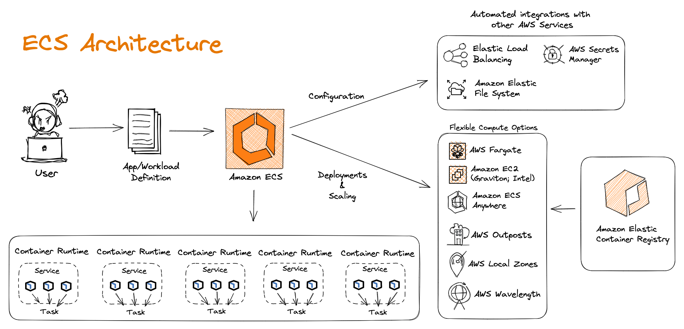
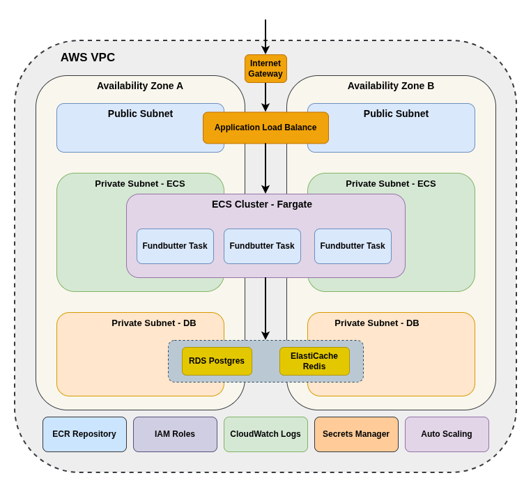

# TaskQueue

> A lightweight, in-memory task queue library for Node.js with async job processing, retry logic, and event emitters.

## Overview

TaskQueue is a simple yet powerful task queue library designed for Node.js applications that need to process asynchronous jobs in the background. It provides a clean API for managing tasks, automatic retry logic for failed jobs, and event-based monitoring of queue activity.

Perfect for background job processing in web servers, microservices, or any application that needs to handle asynchronous operations without blocking the main thread.

## Key Features

- **In-Memory Queue** - Fast, zero-dependency task queue
- **Async/Await Support** - Modern JavaScript promise-based API
- **Automatic Retries** - Configurable retry logic with exponential backoff
- **Event Emitters** - Real-time events for job lifecycle
- **Concurrency Control** - Process multiple jobs in parallel
- **Job Priority** - Support for high, normal, and low priority jobs
- **Progress Tracking** - Monitor job progress and completion
- **TypeScript Support** - Full TypeScript definitions included

## Architecture

The TaskQueue is built around a producer-consumer pattern with an event-driven architecture:




### Architecture Decisions

**Why Producer-Consumer Pattern?**

The producer-consumer pattern was chosen to decouple task submission from task execution. This design enables:

- **Non-blocking submission:** Producers can add tasks without waiting for execution
- **Load leveling:** The queue smooths out bursts of tasks, preventing system overload
- **Independent scaling:** Producers and consumers can scale independently

**Why In-Memory Design?**

TaskQueue uses an in-memory queue for simplicity and performance:

- **Zero dependencies:** No external infrastructure required (Redis, database, etc.)
- **Low latency:** Sub-millisecond job scheduling without network overhead
- **Simple deployment:** Single package with no setup complexity

*Trade-off:* Jobs are lost on process crashes. This is acceptable for non-critical background tasks where occasional job loss is tolerable.

**Why Event-Driven Architecture?**

The event system enables loose coupling between the queue and application logic:

- **Observability:** Applications can monitor job lifecycle without polling
- **Extensibility:** New behaviors can be added by listening to events
- **Debugging:** Event logs provide visibility into queue behavior

**Why Exponential Backoff for Retries?**

Failed jobs are retried with exponential backoff to handle transient failures:

- **Transient errors:** Network issues and temporary service failures often resolve quickly
- **Backoff pressure:** Prevents overwhelming failing services with immediate retries
- **Jitter:** Randomized delays prevent thundering herd problems

### System Components

- **Queue Manager** - Manages the in-memory queue and job scheduling
- **Worker Pool** - Executes jobs with configurable concurrency
- **Retry Handler** - Manages failed job retry logic with exponential backoff
- **Event Emitter** - Publishes job lifecycle events (queued, started, progress, complete, failed)

## Tech Stack

- **Node.js** - 16.x or higher
- **TypeScript** - 5.x (optional, for type definitions)
- **No external dependencies** - Pure JavaScript implementation

## Quick Start

### Prerequisites

- **Node.js** - 16.x or higher
- **npm** or **yarn** - Package manager

### Installation

```bash
# Clone the repository
git clone https://github.com/example/taskqueue.git
cd taskqueue

# Install dependencies
npm install

# Set up environment (optional)
cp .env.example .env
# Edit .env with your configuration
```

### Running

```bash
# Start the example server
npm start

# Or run the demo
node src/demo.js
```

The application will start processing tasks immediately.

## Usage

### Basic Usage

```javascript
const { TaskQueue } = require('./src/index');

// Create a queue that processes 2 jobs concurrently
const queue = new TaskQueue({ concurrency: 2 });

// Add a task to the queue
queue.add(async () => {
  console.log('Processing task...');
  await delay(1000);  // Simulate work
  console.log('Task complete!');
});

// Start processing queued tasks
queue.start();
```

### Advanced Usage

```javascript
const { TaskQueue, JobPriority } = require('./src/index');

// Create a queue with custom configuration
const queue = new TaskQueue({
  concurrency: 5,     // Process up to 5 jobs in parallel
  retries: 3,         // Retry failed jobs up to 3 times
  retryDelay: 1000,   // Wait 1 second before retrying
});

// Listen to job lifecycle events
queue.on('job:complete', (job) => {
  console.log(`Job ${job.id} completed`);
});

queue.on('job:failed', (job, error) => {
  console.error(`Job ${job.id} failed:`, error.message);
});

// Add tasks with different priorities
queue.add(
  async () => {
    await sendEmail();  // High priority: send notification email
  },
  { priority: JobPriority.HIGH }
);

queue.add(
  async () => {
    await generateReport();  // Low priority: background report generation
  },
  { priority: JobPriority.LOW }
);

// Start processing queued tasks
queue.start();

// Graceful shutdown on termination signal
process.on('SIGTERM', async () => {
  await queue.stop();  // Wait for active jobs to complete
  console.log('Queue stopped gracefully');
});
```

### Job Progress Tracking

```javascript
// Add a job with progress tracking
queue.add(async (progress) => {
  for (let i = 0; i < 100; i += 10) {
    await doWork();
    progress(i);  // Report progress percentage
  }
}, { id: 'my-job' });

// Listen to progress updates
queue.on('job:progress', (job, percent) => {
  console.log(`Job ${job.id} is ${percent}% complete`);
});
```

## Configuration

| Variable | Description | Default |
|----------|-------------|---------|
| `concurrency` | Number of jobs to process in parallel | 2 |
| `retries` | Number of times to retry failed jobs | 0 |
| `retryDelay` | Initial delay before retry (ms) | 1000 |
| `timeout` | Maximum job execution time (ms) | 30000 |

Configuration file location: Pass options to TaskQueue constructor

## Testing

```bash
# Run all tests
npm test

# Run with coverage
npm run test:coverage

# Run watch mode
npm run test:watch
```

## Deployment

### Building

```bash
npm run build
```

### Deployment Steps

1. Build the project
2. Publish to npm registry
3. Update version in package.json
4. Create git tag

See [Deployment Guide](docs/deployment.md) for detailed instructions.

## API Documentation

Complete API reference is available at [API Reference](docs/api.md).

## Performance & Scalability

### Performance Characteristics

- **Throughput:** Processes ~1000 jobs/second per worker (simple jobs)
- **Memory:** ~100 bytes per queued job
- **Latency:** Sub-millisecond job scheduling

### Scalability Considerations

- **Single Process:** Limited to single Node.js process
- **In-Memory:** Jobs are lost if process crashes
- **Persistence:** Not suitable for critical production use without persistence
- **Scaling:** Scale horizontally by using multiple queue instances

## FAQ

### Can I persist jobs to disk?

No, TaskQueue is designed as an in-memory queue. For persistence, consider using Redis-backed queues like Bull or BeeQueue.

### How do I handle long-running jobs?

Use the `timeout` option and implement job checkpoints. For very long jobs, consider breaking them into smaller chunks.

### Can I use this in production?

TaskQueue is suitable for non-critical background tasks. For mission-critical applications, use a more robust solution with persistence and clustering support.

### What happens if the process crashes?

All pending jobs in memory will be lost. Implement job persistence or use a Redis-backed queue for reliability.

## Contributing

We welcome contributions!

1. Fork the repository
2. Create a feature branch (`git checkout -b feature/amazing-feature`)
3. Make your changes
4. Add tests for new functionality
5. Ensure all tests pass (`npm test`)
6. Submit a pull request

Please follow our coding standards and include tests for any new features.

## License

MIT License - see LICENSE file for details

---

**Project:** TaskQueue
**Documentation Last Updated:** 2026-03-23
