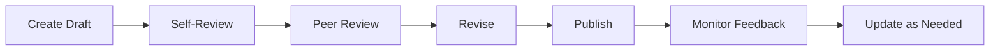

# Documentation Review Process

Ensuring documentation quality through systematic peer review.

## Purpose

Documentation reviews:
- **Catch errors** before they reach users
- **Improve clarity** by getting fresh perspectives
- **Maintain consistency** across all documentation
- **Share knowledge** about the system
- **Mentor new writers** in documentation best practices

## When to Review

Review documentation when:
- New content is created
- Existing content is significantly updated
- Code changes affect documentation
- Documentation is flagged as outdated
- Before major releases

## Review Checklist

### Content Quality

- [ ] **Purpose is clear** - The document's goal is stated upfront
- [ ] **Audience is appropriate** - Content matches the reader's knowledge level
- [ ] **Information is complete** - All necessary topics are covered
- [ ] **Information is accurate** - Technical details are correct
- [ ] **Instructions are actionable** - Steps can be followed as written
- [ ] **Examples are complete** - Code samples work without modification

### Clarity and Readability

- [ ] **Language is clear** - Avoids jargon unless defined
- [ ] **Structure is logical** - Information flows in a sensible order
- [ ] **Headings are descriptive** - Readers can scan to find what they need
- [ ] **Tone is consistent** - Voice and style match other documentation
- [ ] **Explanations are concise** - Respects the reader's time

### Accuracy and Currency

- [ ] **Code examples run** - All code has been tested
- [ ] **Commands work** - Shell commands produce the stated results
- [ ] **Links are valid** - All references point to existing resources
- [ ] **Version information is current** - Software versions are up to date
- [ ] **Screenshots match** - Images reflect the current UI

### Grammar and Style

- [ ] **No spelling errors** - Run a spell checker
- [ ] **Proper grammar** - Sentences are well-formed
- [ ] **Consistent terminology** - Product names and technical terms match style guide
- [ ] **Follows style guide** - Adheres to project documentation standards

### Accessibility

- [ ] **Images have alt text** - Descriptive text for screen readers
- [ ] **Links are descriptive** - Not "click here"
- [ ] **Code has language specified** - Proper syntax highlighting
- [ ] **Contrast is sufficient** - Text is readable for visually impaired users

## Review Process

### 1. Self-Review

Before requesting peer review, review your own work:

```markdown
## Self-Review Checklist

1. Read the document aloud
2. Check all code examples
3. Verify all links
4. Run spell check
5. Compare with style guide
6. Check for consistency with related docs
```

### 2. Peer Review

#### Small Changes (Minor updates, typo fixes)

- **Reviewer:** One peer
- **Timeframe:** 1-2 business days
- **Method:** Inline comments on pull request

#### Medium Changes (New sections, feature documentation)

- **Reviewers:** Two peers (including subject matter expert)
- **Timeframe:** 2-3 business days
- **Method:** Review meeting + written feedback

#### Large Changes (New guides, major rewrites)

- **Reviewers:** Multiple stakeholders
  - Technical writer
  - Subject matter expert
  - User representative (if applicable)
- **Timeframe:** 1 week
- **Method:** Structured review cycle

### 3. Review Meeting Structure

For medium and large changes, schedule a review meeting:

```markdown
## Agenda (30 minutes)

1. Context (5 min)
   - Purpose of the document
   - Target audience
   - What changed

2. Walkthrough (10 min)
   - Page through the document
   - Highlight key sections
   - Note areas needing feedback

3. Discussion (10 min)
   - Reviewer feedback
   - Questions and concerns
   - Agreement on changes

4. Action Items (5 min)
   - List of changes needed
   - Owners and deadlines
   - Follow-up review date
```

### 4. Feedback Guidelines

#### For Reviewers

**Give constructive feedback:**

```markdown
## Good Feedback

❌ Bad: "This section is confusing."

✅ Good: "I found the Quick Start section difficult to follow.
The step about setting environment variables comes after
running the app, which caused an error. Consider moving
environment setup earlier in the process."
```

**Categorize feedback:**

- **Must fix** - Blocks publication (errors, critical issues)
- **Should fix** - Important improvements (clarity, completeness)
- **Nice to have** - Optional enhancements (style, polish)
- **Question** - Needs clarification (unclear intent)

#### For Authors

**Respond to feedback:**

- **Fix** - Make the requested change
- **Discuss** - Start a conversation if you disagree
- **Defer** - Document for future updates if non-critical
- **Reject** - Explain why (with valid reason)

### 5. Approval and Publication

```markdown
## Approval Criteria

Documentation can be published when:

- All "must fix" issues are resolved
- 80% of "should fix" issues are resolved
- Remaining "nice to have" items are documented
- At least one reviewer has approved

## Publication Steps

1. Merge approved changes
2. Update documentation version
3. Deploy to production
4. Announce changes (if applicable)
5. Archive review feedback
```

## Common Issues to Catch

### Technical Issues

| Issue | Why It Matters | How to Catch |
|-------|---------------|--------------|
| Outdated version numbers | Causes user confusion | Check against latest release |
| Broken links | Damages credibility | Use link checker tools |
| Non-working code examples | Wastes user time | Copy and run all examples |
| Missing prerequisites | Causes setup failures | Verify from clean environment |

### Clarity Issues

| Issue | Why It Matters | How to Catch |
|-------|---------------|--------------|
| Undefined acronyms | Alienates new users | Look for first use |
| Passive voice | Reduces engagement | Search for "is/are by" |
| Long paragraphs | Hard to scan | Look for 5+ sentence blocks |
| Buried lead | Wastes reader time | Check first paragraph |

### Structural Issues

| Issue | Why It Matters | How to Catch |
|-------|---------------|--------------|
| Missing sections | Incomplete coverage | Compare with template |
| Poor heading hierarchy | Hard to navigate | Check H1 → H2 → H3 order |
| Inconsistent terminology | Confuses readers | Search for variations |
| Logical gaps | User gets stuck | Walk through scenarios |

## Review Tools

### Automated Tools

```bash
# Spell checking
markdown-spellcheck docs/

# Link checking
markdown-link-check docs/**/*.md

# Style checking
markdownlint docs/**/*.md

# Linting with rules
vale docs/
```

### Review Platforms

| Platform | Best For | Features |
|----------|----------|----------|
| GitHub PR | Code/docs together | Inline comments, diff view |
| Google Docs | Collaborative editing | Real-time, suggestions |
| Notion | Internal docs | Database views, sharing |
| Confluence | Enterprise knowledge | Integration, permissions |

### Review Templates

#### Pull Request Template

```markdown
## Documentation Review

### Summary
[Brief description of what this document covers]

### Type of Change
- [ ] New documentation
- [ ] Update to existing documentation
- [ ] Bug fix (inaccurate information)
- [ ] Style/grammar fix

### Testing
- [ ] All code examples tested
- [ ] All links verified
- [ ] Spell check passed
- [ ] Compared against style guide

### Review Focus Areas
Please pay special attention to:
1. [Specific area 1]
2. [Specific area 2]

### Questions
[Any specific questions for reviewers]
```

## Handling Feedback

### Receiving Feedback

**Remember:**
- Feedback is about the document, not you
- Multiple perspectives improve quality
- You don't have to accept every suggestion

**When you disagree:**
- Explain your reasoning clearly
- Provide examples or data
- Suggest alternatives
- Be willing to compromise

### Giving Feedback

**Principles:**
- Be specific, not general
- Explain the impact on the reader
- Suggest improvements
- Acknowledge what works well

**Example scenarios:**

```markdown
## Scenario: Technical Inaccuracy

"The Prerequisites section lists Node.js 14, but the
code uses async/await syntax that requires Node.js 16.
Users on Node.js 14 will encounter syntax errors."

## Scenario: Unclear Instructions

"Step 3 says 'Configure the database' but doesn't specify
what configuration values are needed. A table of required
environment variables would be helpful here."

## Scenario: Structural Issue

"The FAQ section comes before the Quick Start. New users
need to get started first before they encounter common
questions. Consider reordering these sections."
```

## Continuous Improvement

### Collect Metrics

Track review effectiveness:
- Time from draft to publication
- Number of review cycles
- Common issue types
- Post-publication corrections

### Regular Reviews

Schedule periodic reviews of existing documentation:
- **Quarterly** - High-traffic pages
- **Biannually** - Feature documentation
- **Annually** - Reference material

### Feedback Loop



## See Also

- [Style Guide](07-style-guide.md) - Writing conventions
- [Documentation Principles](01-principles.md) - Why good documentation matters
- [README Documentation](02-readme.md) - README-specific guidelines
